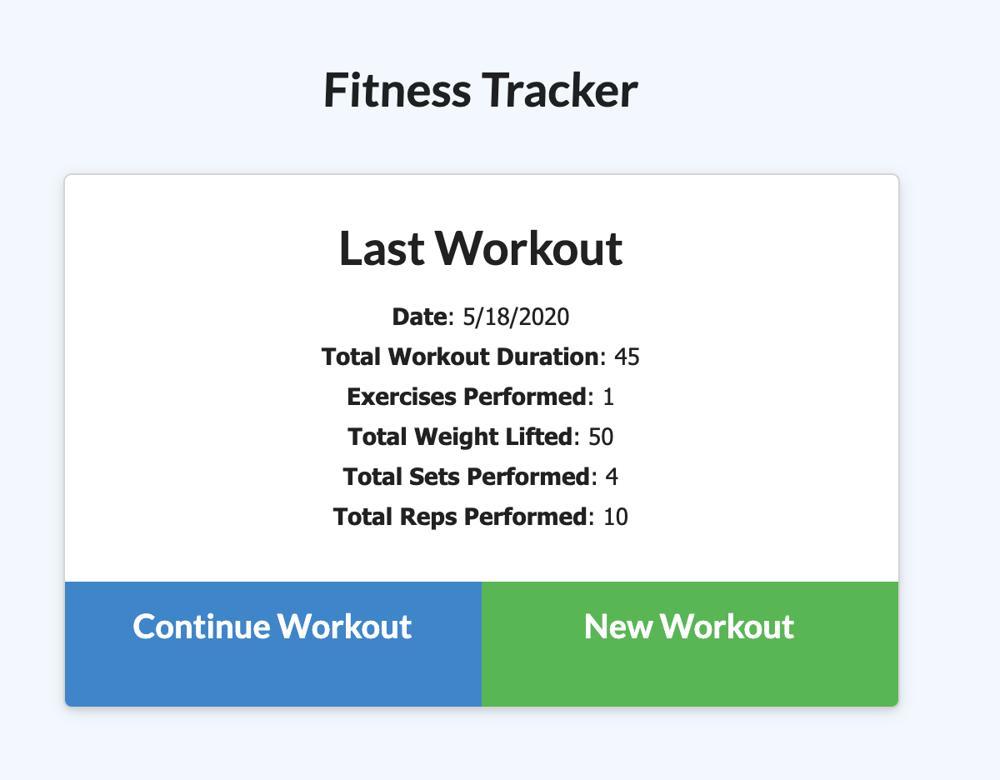
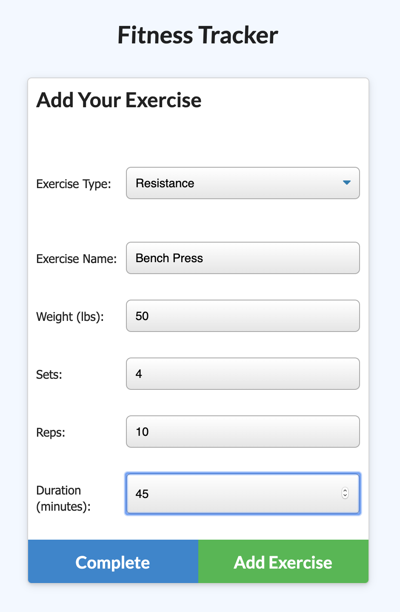

## Name and live url
Stephanie Kuo
Fitness Tracker
https://sfds1.github.io/fitnessTracker/

## Description
A consumer will reach their fitness goals quicker when they track their workout progress.


## What does the app do?
As a user, I want to be able to view create and track daily workouts. I want to be able to log multiple exercises in a workout on a given day. I should also be able to track the name, type, weight, sets, reps, and duration of exercise. If the exercise is a cardio exercise, I should be able to track my distance traveled.

## How does it work?
The seed data for the application can be added to the DB by running the below command in the proper folder:

```sh
node seed.js 
```

The application  will be invoked with the following command:

```sh
nodemon server.js
```

In dev environment can see app by entering the following url in a web browser

http://localhost:3001/

## Technologies
Node, HTML, CSS, Javascript, MongoDB

## Languages, frameworks, various tools
This application uses Node packages Express, FS, PATH and MongoDB.

## Challenges
Knowing to put the wildcard (*) route at the end of all the routes.

## Your experience building this app
This application gave me a lot of good things to use on the front end.

## What was difficult
Figuring out to get the duration field to dynamically update

## What did you learn
I learned more about Mongo databases

## How did you go about solving a problem
Research

## Screenshot





## Live app, not code

